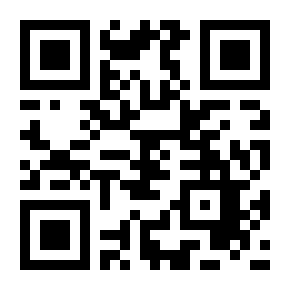

# QRCodeEx

Simple QR Code Generator written in Elixir with no other dependencies.

This project is a fork and a successor of [SiliconJungles/eqrcode](https://github.com/SiliconJungles/eqrcode). It adds the following functionallity:
* more error coreection levels: :m, :q, :h (before was only :l)
* more QR code versions: 8..40  (before was only 1-7)

We tried to keep the project api compatible with [SiliconJungles/eqrcode](https://github.com/SiliconJungles/eqrcode).
## Installation

```elixir
def deps do
  [
    {:qrcode_ex, "~> 0.1.0"}
  ]
end
```

## Using QRCodeEx (Basic Usage)

You can use QRCodeEx to generate QR Code in SVG or PNG format.

```elixir
qr_code_content = "your_qr_code_content"

# To SVG
qr_code_content
|> QRCodeEx.encode()
|> QRCodeEx.svg()

# To PNG
qr_code_content
|> QRCodeEx.encode()
|> QRCodeEx.png()
```


Note that the PNG format is only the binary. You still have to write the data to a file:

```elixir
qr_code_png =
  qr_code_content
  |> QRCodeEx.encode()
  |> QRCodeEx.png()

File.write("path/where/you/want/to/save.png", qr_code_png, [:binary])
```

You should be able to see the file generated in the path you specified.

## Image Rendering Options

### SVG

You can pass in options into `QRCodeEx.svg()`:

```elixir
qr_code_content
|> QRCodeEx.encode()
|> QRCodeEx.svg(color: "#03B6AD", shape: "circle", width: 300, background_color: "#FFF")
```


You can specify the following attributes of the QR code:

* `color`: In hexadecimal format. The default is `#000`
* `background_color`: In hexadecimal format or `:transparent`. The default is `#FFF`.
* `shape`: Only `square` or `circle`. The default is `square`
* `width`: The width of the QR code in pixel. Without the width attribute, the QR code size will be dynamically generated based on the input string.
* `viewbox`: When set to `true`, the SVG element will specify its height and width using `viewBox`, instead of explicit `height` and `width` tags.

Default options are `[color: "#000", shape: "square", background_color: "#FFF"]`.

### PNG

You can specify the following attributes of the QR code:

* `color`: In binary format in the RGB order. The default is `<<0, 0, 0>>`
* `background_color`: In binary format or `:transparent`. The default is `<<255, 255, 255>>`
* `width`: The width of the QR code in pixel. (the actual size may vary, due to the number of modules in the code)

By default, QR code size will be dynamically generated based on the input string.

### ASCII

You can also render the QRCode in your console:

```elixir
qr_code_content
|> QRCodeEx.encode()
|> QRCodeEx.render()
```

## Credits

* We reused most of the code from [SiliconJungles/eqrcode](https://github.com/SiliconJungles/eqrcode) to generate QR Codes up to version 7 and an error correction level of l.

* [SiliconJungles/eqrcode](https://github.com/SiliconJungles/eqrcode) reused most of the code from [sunboshan/qrcode](https://github.com/sunboshan/qrcode) to generate the matrix required to render the QR Code. We also reference [rqrcode](https://github.com/whomwah/rqrcode) on how to generate SVG from the QR Code matrix.

## License

This project is Licensed under the [MIT License](https://github.com/inspired-consulting/qrcode_ex/blob/main/LICENSE).
